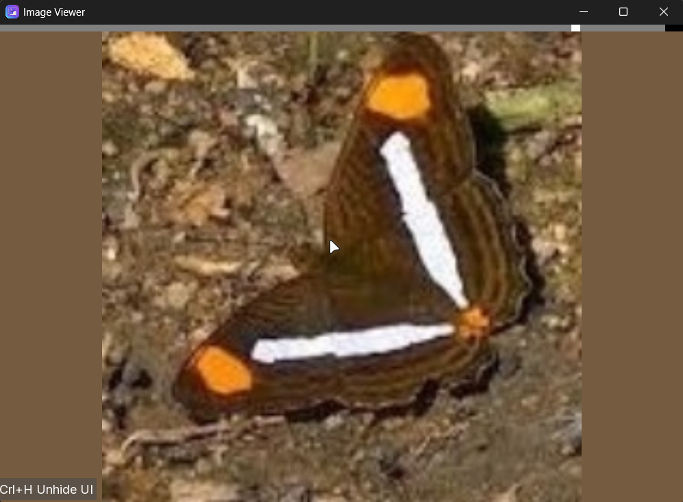
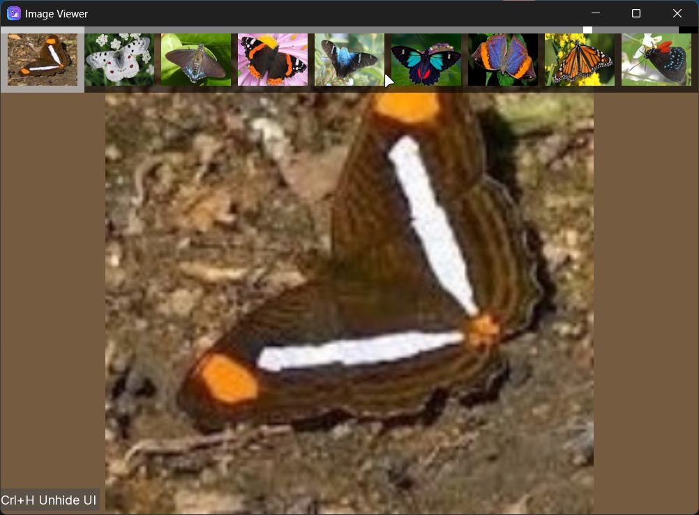
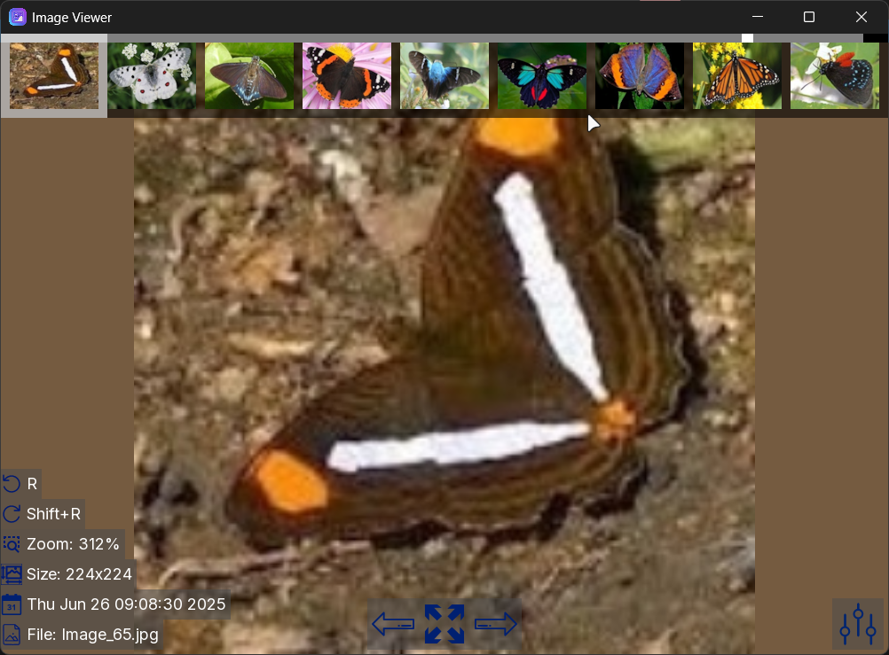
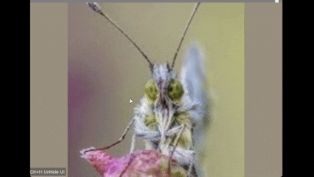
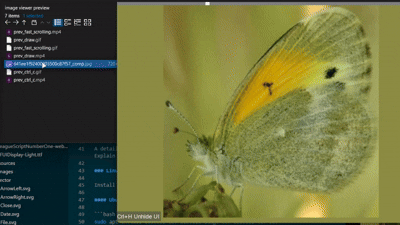

# ImageViewer

A simple cross-platform image viewer built with SDL2 and related libraries.
This project demonstrates a minimal setup for loading and displaying images using SDL2 with CMake.

## Screenshots











## Features

-  **Load and display common image formats (PNG, JPG, etc.)** 
-  **SDL2-based rendering**
-  **Cross-platform support (Windows & Linux)** 
-  **Simple packaging support via CPack (DEB, RPM, TGZ)t**
-  **Fast scrollong and thumbnails preview**

   

-  **Copy images to clipboard by pressing ctrl-c**

   

-  **Draw on top of an image**

   

-  **Drag and drop**

   


## Requirements
###   General
-  **CMake ≥ 3.16**
-  **C++17 compatible compiler**
A detailed description of what this project does and who it's for. Explain the problem it solves and why it's useful.

### Linux

Install dependencies using your package manager:

#### Ubuntu / Debian:

```bash
sudo apt install libsdl2-dev libsdl2-image-dev libsdl2-ttf-dev libsdl2-gfx-dev
```
### Windows (MSVC)
-  **Visual Studio (recommended)**
Prebuilt SDL2 libraries placed in:
```bash
libs/
├── include
├── lib
├── bin
```
Required libraries:

-  **SDL2**
-  **SDL2_image**
-  **SDL2_ttf**
-  **SDL2_gfx**

## Build Instructions
### Linux

```bash
mkdir build
cd build
cmake ..  -DCMAKE_BUILD_TYPE=Debug
cmake ..  -DCMAKE_BUILD_TYPE=Release
cmake --build .
```

Run:
```bash
./viewer
```
### Windows (Visual Studio)
```powershell
mkdir build
cd build
cmake .. -G "Visual Studio 17 2022"
cmake --build . --config Release
```
Executable will be in:

build/Release/viewer.exe

DLLs will be copied automatically after build.

## Resources

All files in the res/ directory are automatically copied to the output directory after build.
Place your images there to ensure they are available at runtime.

Output Naming
**Debug build: debug_viewer**
**Release build: viewer**

## Packaging (Linux)

This project supports packaging via CPack:

```bash
cd build
cpack
```

Generated packages:

.deb (Debian/Ubuntu)
.rpm (Fedora/RHEL)
.tar.gz

## Notes
On Windows, ensure all required .dll files are present in libs/bin. They will be copied automatically.
On Linux, SDL2 dependencies are resolved via system packages.
SDL2_gfx is linked manually and must be available on your system.
## License

This project is licensed under the GPL v3 License - see the LICENSE file for details.


